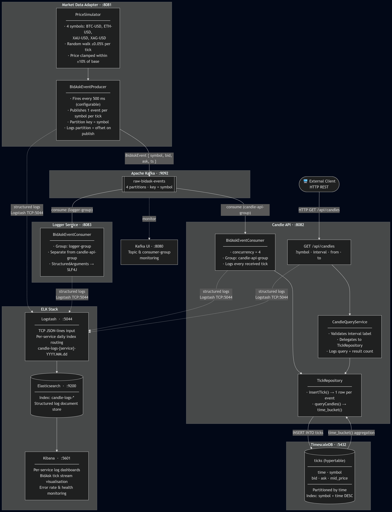

# Candle Aggregation Service

A platform that ingests a real-time stream of bid/ask market data, aggregates it into OHLCV candlestick format, and exposes a TradingView-compatible history API.

---

## Table of Contents

1. [Architecture Overview](#architecture-overview)
2. [Assumptions and Trade-offs](#assumptions-and-trade-offs)
3. [Module Breakdown](#module-breakdown)
4. [Data Flow](#data-flow)
5. [API Reference](#api-reference)
6. [Running the Service](#running-the-service)
7. [Running Tests](#running-tests)

---

## Architecture Overview

```
┌──────────────────────────────────────────────────────────────┐
│                                                              │
│                                                              │
│  market-data-adapter ──► Kafka ──► candle-api                │
│       (producer)      (4 partitions)  (consumer + REST API)  │
│                                            │                 │
│                                       TimescaleDB            │
│                                     (ticks hypertable)       │
│                                                              │
│  Kafka ──► logger-service ──► Logstash ──► Elasticsearch     │
│              (archival)                        │             │
│                                            Kibana            │
└──────────────────────────────────────────────────────────────┘
```

---

## Assumptions and Trade-offs

### Aggregation at query time, not write time

Raw ticks are stored 1:1 in the hypertable. OHLCV is computed on-the-fly using `time_bucket()`, `first()`, and `last()` — TimescaleDB aggregate functions that respect chronological order.

**Pro**: Zero write-side complexity, no partial-candle state, instant support for any interval without schema changes, correct behaviour on late-arriving ticks.

**Con**: Higher read CPU per query. Mitigatable with TimescaleDB continuous aggregates if throughput grows.

### Mid-price for OHLC

No last-trade price is available from a bid/ask-only feed, so `(bid + ask) / 2.0` is stored and aggregated. This is standard practice in FX and crypto markets.

### Synthetic volume (tick count)

Volume = number of ticks per window. Without a matching engine, notional traded volume is unavailable.

### Kafka partition-per-symbol ordering

4 partitions, symbol as key → each partition receives ticks for exactly one symbol in arrival order. Consumer concurrency = 4 ensures no inter-symbol locking on the database while preserving intra-symbol write ordering.

### Stateless consumer

`candle-api` holds no in-memory window state. Ticks go straight to the DB. On restart the consumer replays from the last committed Kafka offset; no candle data is lost.

### No authentication

The `GET /history` endpoint is unauthenticated. In production, add an API gateway or Spring Security filter.

### No pre-created hypertable extension in schema.sql

The production `schema.sql` assumes the TimescaleDB extension is already active (as it is in the official Docker image). The integration test (`TickRepositoryIntegrationTest`) issues `CREATE EXTENSION IF NOT EXISTS timescaledb` explicitly before creating the table to make the test self-contained.

---

## Module Breakdown

### `common` (shared library)

Pure Java JAR — no Spring Boot repackaging. Defines all shared domain types and constants:

### `market-data-adapter`

Simulates an exchange tick feed using a random walk price model. Runs on a 500 ms schedule and publishes one `BidAskEvent` per symbol per tick (8 ticks/sec total) to Kafka, partitioned by symbol.

Key classes: `PriceSimulator`, `BidAskEventProducer`

### `candle-api`

The core service. Consumes raw ticks from Kafka and stores them in TimescaleDB. Serves OHLCV candle history through a REST API in TradingView UDF format. Aggregation happens entirely at query time using `time_bucket()` — no pre-computation.

Key classes: `BidAskEventConsumer`, `TickRepository`, `CandleQueryService`, `HistoryController`

### `logger-service`

Independent Kafka consumer (group `logger-group`) that ships all ticks as structured JSON logs to Logstash → Elasticsearch → Kibana. Uses async appender so back-pressure never stalls processing threads.

Key class: `CandleEventConsumer`

---

## Data Flow




---

## API Reference

### `GET /history`

Returns OHLCV candle history in TradingView UDF parallel-array format.

**Query Parameters**

| Parameter | Type | Required | Description |
|---|---|---|---|
| `symbol` | string | yes | Trading pair, e.g. `BTC-USD`, `ETH-USD`, `XAU-USD`, `XAG-USD` |
| `interval` | string | yes | Candle size: `1s`, `5s`, `1m`, `15m`, `1h` |
| `from` | long | yes | Range start — UNIX seconds, inclusive |
| `to` | long | yes | Range end — UNIX seconds, exclusive |

**Success response (data exists)**

```json
{
  "s": "ok",
  "t": [1620000000, 1620000060],
  "o": [29500.5,    29501.0],
  "h": [29510.0,    29505.0],
  "l": [29490.0,    29500.0],
  "c": [29505.0,    29502.0],
  "v": [10,         8]
}
```

**No data in range**

```json
{ "s": "no_data" }
```

**Validation error (HTTP 400)**

```json
{ "s": "error", "errmsg": "Unknown interval: 2x. Supported: [1s, 5s, 1m, 15m, 1h]" }
```

### Health

```
GET /actuator/health   →  includes Kafka consumer and PostgreSQL sub-indicators
GET /actuator/metrics
```

---

## Running the Service

### Prerequisites

- Docker and Docker Compose
- Java 21 SDK (for local builds only)
- Maven 3.9+ (for local builds only)

### Start everything with Docker Compose

```bash
# Build all modules
mvn clean package -DskipTests

# Launch all services (Zookeeper, Kafka, TimescaleDB, ELK, all app services)
docker compose up --build
```

Services come up in dependency order. Allow ~30 seconds for TimescaleDB to accept connections.

| Service | URL |
|---|---|
| History API | `http://localhost:8082/history?symbol=BTC-USD&interval=1m&from=0&to=9999999999` |
| Adapter health | `http://localhost:8081/actuator/health` |
| Candle-API health | `http://localhost:8082/actuator/health` |
| Logger health | `http://localhost:8083/actuator/health` |
| Kafka UI | `http://localhost:8080` |
| Kibana | `http://localhost:5601` |

---

## Running Tests

The test suite is split into three tiers by speed and infrastructure requirements.

### Tier 1 — Unit tests (no infrastructure required)

All pure unit tests and Spring MVC slice tests. Run fast, require no external processes.

```bash
# All modules
mvn test

# Individual modules
mvn test -pl common
mvn test -pl market-data-adapter
mvn test -pl candle-api -Dgroups="!integration"
```

### Tier 2 — Integration tests (require Docker)

Tagged `@Tag("integration")`. Two test classes:

| Test class | Infrastructure | Scope |
|---|---|---|
| `TickRepositoryIntegrationTest` | Testcontainers (TimescaleDB image) | Real SQL — `INSERT`, `time_bucket()`, `first()`, `last()`, boundary conditions, multi-window bucketing |
| `HistoryApiIntegrationTest` | `@EmbeddedKafka` + H2 | Full Spring context — Kafka consumer wiring, REST layer, error handling |

```bash
# Run integration tests only (Docker must be running)
mvn verify -pl candle-api -Dgroups=integration

# Run all tests including integration
mvn verify
```

> **Note**: `TickRepositoryIntegrationTest` pulls `timescale/timescaledb:latest-pg15` on first run. Ensure Docker has internet access or pre-pull the image.